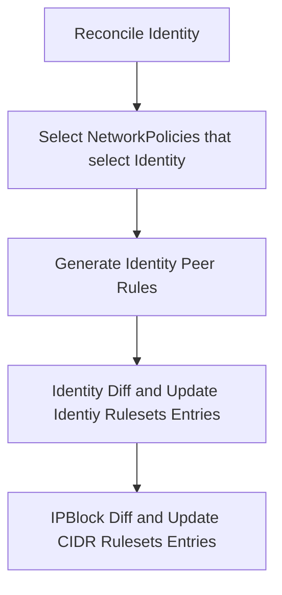
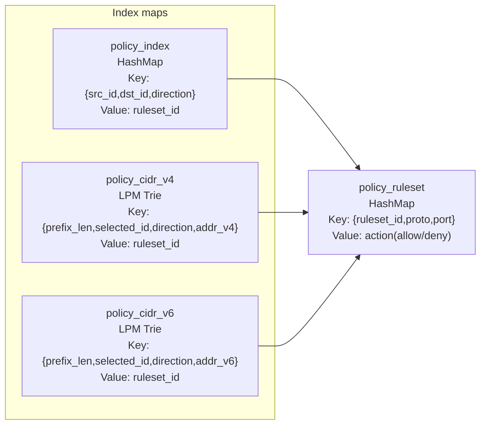

# mesh-cni-policy-controller

`mesh-cni-policy-controller` reconciles Kubernetes NetworkPoliy configuration into eBPF policy maps used by the TC programs attached to network interface(s) in the pod network namespace.

## Controller Flow

## Policy Map Layout

`policy_index` and `policy_ruleset` form a two-step lookup for identity-to-identity policy.

`policy_cidr_v4`/`policy_cidr_v6` provide ipBlock policy keyed by selected identity + direction + peer CIDR prefix.

## Datapath Lookup Model

Current packet policy evaluation in TC:

1. Check conntrack short-circuit as NetworkPolicy is stateful, allow if present.
2. Evaluate identity policy via `policy_index -> policy_ruleset`.
3. Evaluate CIDR policy via `policy_cidr_v4 -> policy_ruleset`.
4. Deny only when both identity and CIDR checks deny.

